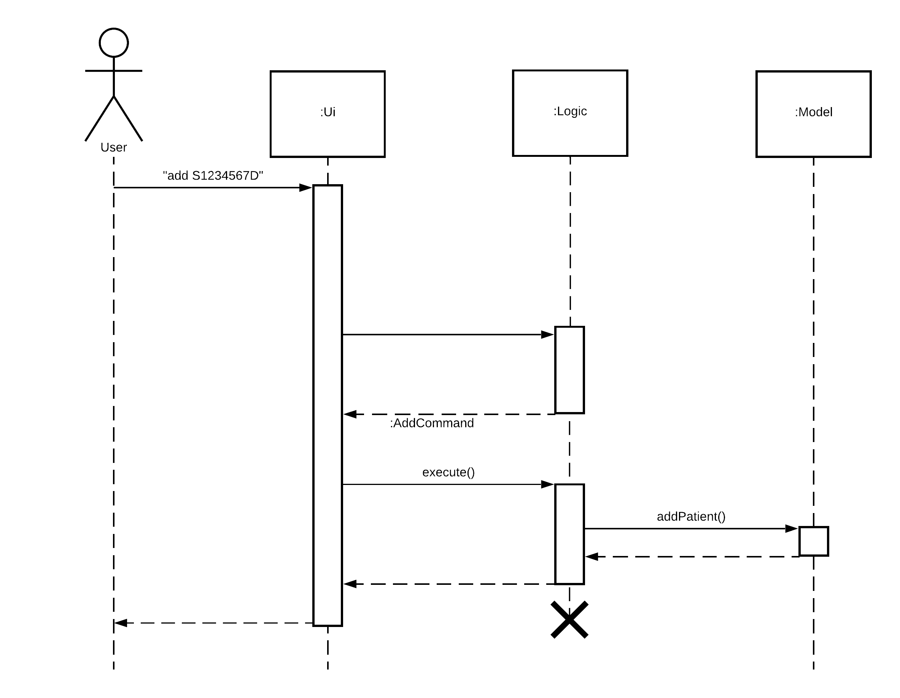
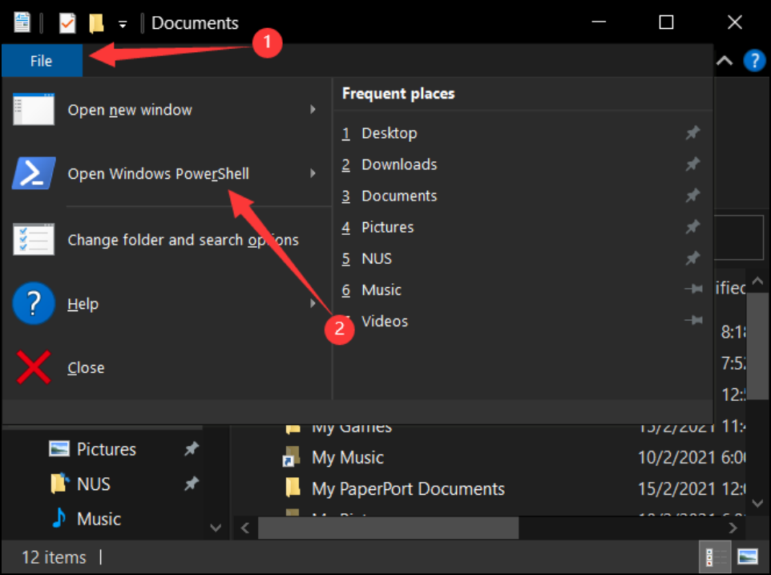

# Developer Guide

## Table of Contents
* [Introduction](#introduction)
* [Setting up the project in your computer](#setting-up-the-project-in-your-computer)
* [Design and implementation](#design--implementation)
* [Appendix A: Product scope](#appendix-a-product-scope)
   * [Target user profile](#target-user-profile)
   * [Value proposition](#value-proposition)
* [Appendix B: User stories](#appendix-b-user-stories)
* [Appendix C: Non-Functional Requirements](#appendix-c-non-functional-requirements)
* [Appendix D: Glossary](#appendix-d-glossary)
* [Appendix E: Instructions for Manual Testing](#appendix-e-instructions-for-manual-testing)

## Introduction

Patient Manager is a _Command Line Interface_ (CLI) application for _general practitioners_ (GP)
who work in clinics to manage their patient list. This includes a recording/retrieval of
past record of visit, scheduling of the next appointment, and some other features listed below.
With the Patient Manager, GPs will be able to reduce paperwork and have a more efficient way
to organize the records of their patients.

## Setting up the project in your computer

First, fork this repo, and clone the fork into your computer.

If you plan to use Intellij IDEA (highly recommended):
1. Configure the JDK: Follow the guide 
   [Intellij IDEA: Configuring the JDK @SE-EDU/guides](https://se-education.org/guides/tutorials/intellijJdk.html) \
   IDEA: Configuring the JDK to ensure Intellij is configured 
   to use JDK 11.
2. Import the project as a Gradle project: Follow the guide 
   [Intellij IDEA: Importing a Gradle project @SE-EDU/guides](https://se-education.org/guides/tutorials/intellijImportGradleProject.html) \
   IDEA: Importing a Gradle project to import 
   the project into IDEA.
   > ❗ Note: Importing a Gradle project is slightly different from importing a normal Java project.
3. Verify the setup: Run `seedu.duke.PatientManager` and try a few commands. 
   Run the tests to ensure they all pass.

## Design & implementation

### Help command

When invoked by the user via the `help` command, information about the available commands is printed.
If arguments are provided, the arguments are parsed into the separate commands, and the information about each
command present in the arguments is printed in order. If the user provides an invalid command, an invalid command
message is shown, and the messages for the following commands are printed.

#### Alternatives considered

The original version of this command simply printed out the information messages of all commands. 
However, with a growing list of commands, we were worried that the help message would be too long and would
require scrolling.

The current version reads the arguments that are provided by the user, and prints out information messages for each
of the commands indicated. Unknown/invalid commands will not be skipped with a message indicating that the command is 
invalid, and the subsequent commands will continue to be processed. 

A future consideration would be to convert the message printed out when no arguments are provided to only print a list
of available commands for easier reference:
```
> help
-----------------------------------------------------------------
List of available commands:
...
...
Enter help <command> for more details of each command
-----------------------------------------------------------------
```
### Architecture

The Architecture Diagram shown above gives a high-level explanation of PatientManager.
Given below is a brief overview of each component.

The user starts the program from the main class `PatientManager`.

This class is responsible for:
- When the app is launched: Initializing the other components in the correct sequence and connecting them with each other
- When the app exits: Shuts down the components and invokes cleanup methods where necessary

`Commons` contains constants that are shared across the other classes.

`UI` is responsible for reading user input.
It is also responsible for displaying the response from PatientManager to the screen.

`Logic` parses and executes commands.

`Model` contains the data of PatientManager in memory and models the various entities (e.g patients, medical records).

`Storage` manages writing and reading saved data to and from the hard disk.

#### How the architecture components interact with each other

The Sequence Diagram below shows how the components interact with each other for the scenario where the user issues the command `add S1234567D`.



The sections below give more details for each component.

### UI Component
### Logic Component
### Model Component

API: `Patient.java`, `Record.java` and `Data.java` 

`Record.java` contains:
- all the symptoms recorded by a GP during the consultation
- all the diagnoses made by a GP during the consultation
- all the prescriptions made by a GP during the consultation
- the most recently added symptom/diagnosis/prescription, which corresponds to the most recently executed `record` command

`Patient.java` contains:
- the patient's NRIC/FIN number, which uniquely identifies the patient
- a `TreeMap<LocalDate, Record>` which maps the patient's consultation dates to the visit records for that date

`Data.java`,
- stores a `SortedMap<String, Patient>`, which maps the patient's NRIC/FIN number to their corresponding `Patient` instance
- implements methods to add new patients and delete existing patients
- implements methods to load an existing patient's medical records

### Storage Component
### Common Classes

## Appendix A: Product scope

### Target user profile

{Describe the target user profile}

### Value proposition

Through Patient Manager, general practitioners are able to manage patients faster than a typical mouse/GUI driven app.

{Describe the value proposition: what problem does it solve?}

{more to be added}

## Appendix B: User Stories

|Version| As a ... | I want to ... | So that I can ...|
|--------|----------|---------------|------------------|
|v1.0|GP in a polyclinic|add a new patient|record a patient|
|v1.0|GP in a polyclinic|view the list of patients|track the list of patients|
|v1.0|GP in a polyclinic|select a specific patient's records|access the patient's records|
|v1.0|GP in a polyclinic|add new record for a patient|refer to them during future consultations|
|v1.0|GP in a polyclinic|retrieve the patient's past records|refer to them during the current consultation|
|v1.0|new User|view list of available commands|refer to them if I have any problems|
|v2.0|GP in a polyclinic|delete a patient|remove patients are no longer required to be tracked|
|v2.0|GP in a polyclinic|delete a patient's records|remove records that I no longer need|
|v2.0|GP in a polyclinic|know if I entered a invalid Patient ID|make sure no mistake is made recording the patient's ID|
|v2.0|GP in a polyclinic|load and save existing data|work on the data on another device|

## Appendix C: Non-Functional Requirements

1. Should work on any mainstream OS as long as it has Java 11 or above installed. 
2. Should be able to hold up to 1000 patients without a noticeable sluggishness in performance for typical usage.
3. A user with above average typing speed for regular English text (i.e. not code, not system admin commands) should 
   be able to accomplish most of the tasks faster using commands than using the mouse.
4. The data should be stored locally and should be in a human editable text file.
5. The application should work without requiring an installer.
6. The application should be at most 100 MB in size.
7. The application should not rely on any remote server, or database management system.

<!-- NFRs taken from: https://nus-cs2113-ay2021s2.github.io/website/admin/tp-constraints.html -->

## Appendix D: Glossary

- *Mainstream OS* - Windows, Linux, and OS-X platforms.
- *General Practitioner* - A doctor based in the community who treats patients with minor or chronic illnesses and
  refers those with serious conditions to a hospital. Their duties are not confined to specific organs of the body,
  and they have particular skills in treating people with multiple health issues.

## Appendix E: Instructions for Manual Testing

### Launch and Shutdown

1. Initial launch
   1. Download `tp.jar` and copy into an empty folder.
   2. Open a terminal/command line (cmd)/powershell. A Windows 10 OS' screenshot is here:
      
   3. Execute `java -jar tp.jar` to start the Patient Manager.
   4. Expected: Shows the welcome message as shown below
<!--
### Automated Testing
We have both JUnit Test and IO Redirection Test. To run these tests, execute these commands in a shell or CMD:
```
### For JUnit tests
# *nix OS and MacOSX bash
./gradlew check
# Windows CMD
gradlew.bat check

### For I/O redirection tests
cd text-ui-test
# *nix OS and MacOSX bash
./runtest.sh
# Windows CMD
runtest.bat
```

### Manual Testing
The current version does not support storing the data on the local drive. To start with the manual testing process, you may refer to the "QuickStart" section of the [User Guide](UserGuide.md).
-->